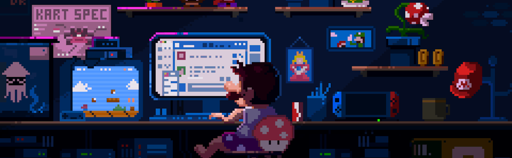

<!--  -->

## Hi there, I'm TorryDo (Tri Do Nguyen) 👋

### A Passionate Mobile Engineer 🔥

I'm always learning and experimenting with new technologies to make my designs and features stand out. Collaboration and responsibility are key principles in my work, and I believe that they are essential for creating top-quality projects. 🏆

######

- 🔥 Mobile: `Android Native`  `Flutter`
- 🍀 Language: `Java/Kotlin`  `Python`  `Dart`
- 🎨 Open Source Contributor
- 💌 Available for your next Awesome Project

 

    
<b>📊 Github Stats </b>

    

        
    

## Reach me via 👇

  <!-- LINKEDIN -->
  
  
  <!-- FACEBOOK -->
  

  <!-- GMAIL -->
  

  <!-- PLAY STORE -->
  

  <!-- TELEGRAM -->
  

  <!-- FIVERR -->
  

  <!-- UPWORK -->
  

